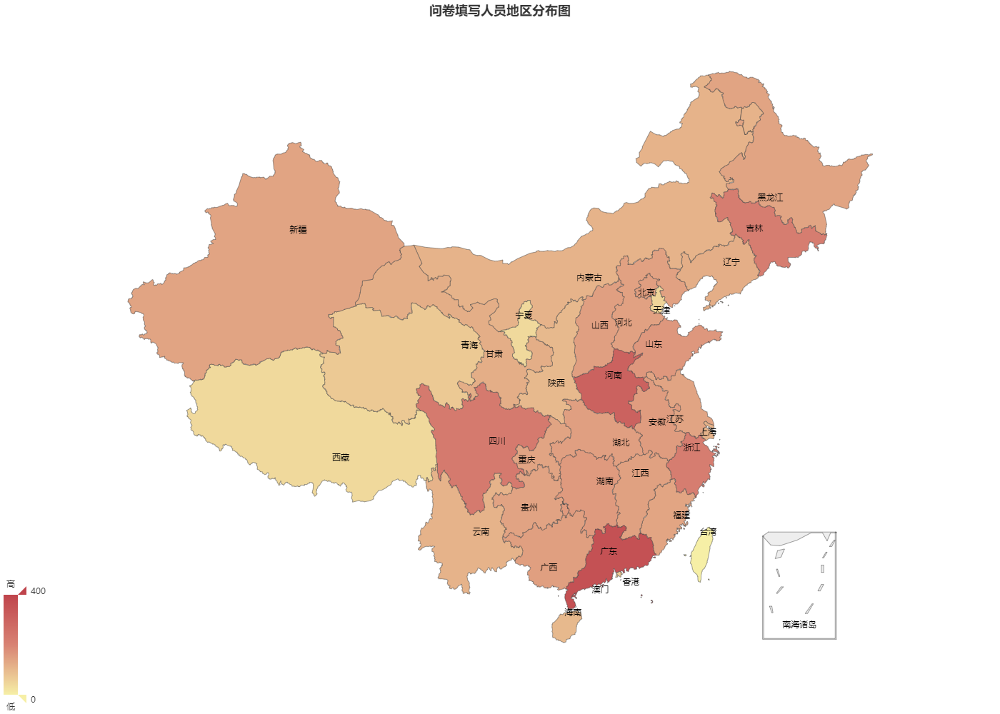
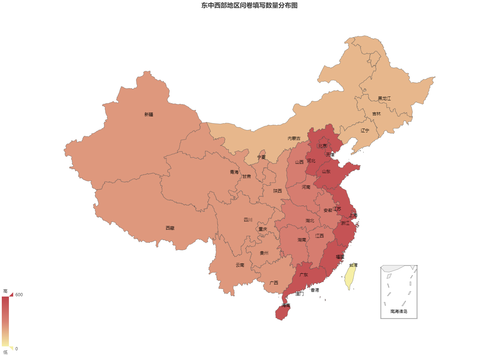
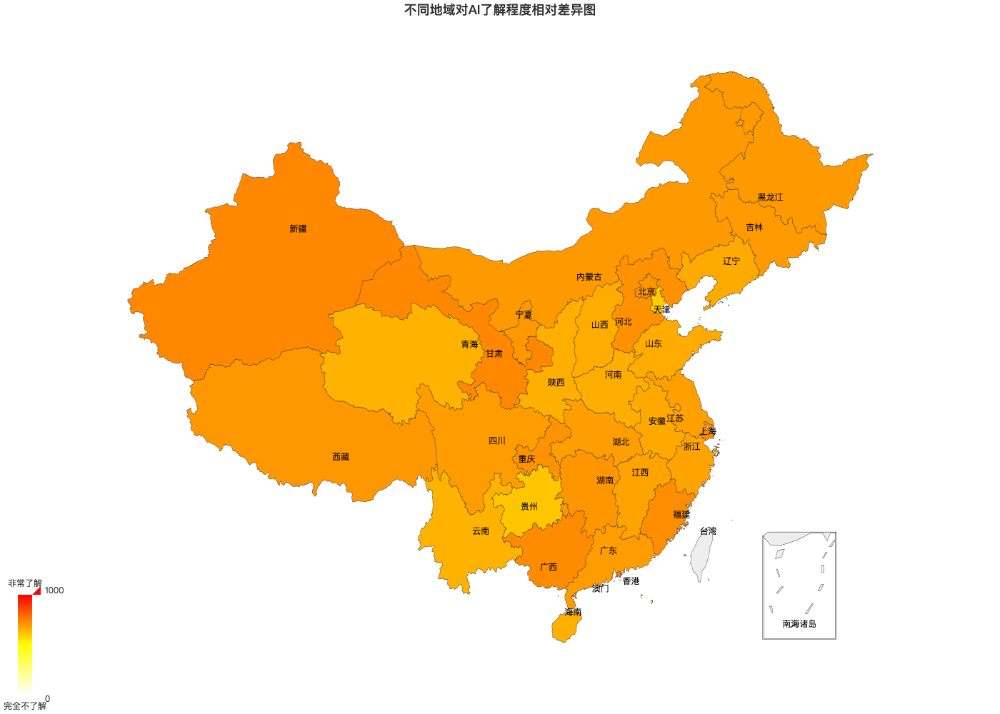
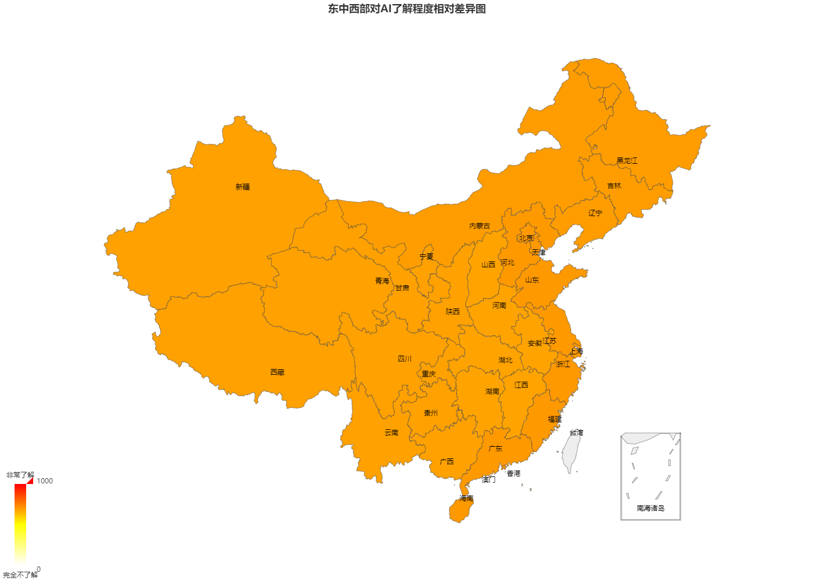
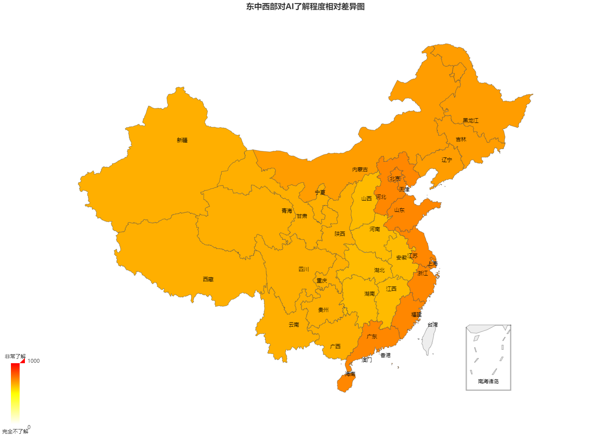

# 政务调研
# 探究90后对人工智能相关伦理道德问题的认知与看法
写在最前：  
由于调研尚未完成，以及隐私问题，暂不公开原始数据。  
现在仅公开本人负责的地理区划分析部分的绘图代码以及调研报告，方便大家交流学习。markdown贴图不方便，所以暂时只更新了两小节的图，有空就继续更。
## 同时更希望您也能参与本次问卷调查
[调查问卷传送门](https://www.wjx.cn/report/21490203.aspx)  
如果链接失效说明此阶段调研已结束，新的调研开始后会更新链接。

## 摘要：
>人工智能技术的发展已经历 60 多载的时光，其技术发展问题的研究成果较为丰盛，对人工智能相关的伦理道德问题的探讨，也是近年来新兴的研究热点之一。但本小组发现，对人工智能相关伦理道德问题的研究，都主要集中在其技术本身，即以人工智能技术作为探究的主体，而针对青年群体（特别是90后）对人工智能相关的伦理道德问题的认知、看法与态度的调查成果，可谓少之又少。本次调研以90后青年群体为对象，运用问卷调研、焦点小组访谈的研究方法，探讨其对人工智能所涉及的人权、社会责任等伦理道德问题的认知与看法，旨在为社会提供一份清晰明了、具有代表性的调研成果，为今后人工智能领域的发展建言献策。
## 关键词:
>人工智能；90后群体；青年；伦理道德；调查研究

### 略过其他部分
## 4.4 地理区划分析

>考虑到我国国情的特殊性，尤其是改革开放以来，国家战略和政策使得东部沿海省份优先发展，经济体量明显大于其他地区，相应的科技文化教育发达程度也明显高于其他地区。而人工智能这一新兴科学技术，刚刚脱胎于高等学府，立足于高校人才和先进计算机科技企业，现在主要研发和产品推广也集中于一线城市与东部三大发达经济圈。这是因为一线城市及发达省份的高互联网普及率，高信息化程度，给人工智能技术的试点与应用提供了基础物质条件。而人工智能技术的发展，对在这些地区生活工作学习的90后青年人群也有着深远的影响。

>所以，很有必要划分区域进行分析，对不同经济发展水平的地区进行横向比较，探究经济、文化、教育发展程度对青年关于人工智能伦理道德相关问题看法的影响因素。这对于地区之间如何协调发展，如何缩小地区差异，加速落后地区发展的问题有着重要意义。
>在本部分，我们重点分析了不同地域90后青年群体对以下几方面的看法：
>>1. 人工智能了解程度
>>2. 人工智能与环境问题
>>3. 人工智能的安全性问题
>>4. 人工智能的权利与义务
>>5. 强人工智能前瞻性探讨
>>6. 人工智能恋爱伦理
>关于为何选择以上几方面，以及它们跟地理区划的不同有何影响等内容，将在后部分的详细说明与分析中给出。

#### 区域划分方法
>关于如何划分区域，考虑到人工智能是典型的高科技应用，需要发达的经济文化，先进的科研教育作为支撑，故应按照高校与高新技术型企业的分布密集度进行划分。而我国高校与高新技术型企业的分布情况正好与地区经济发展程度相当，所以本文根据经济发展程度划分区域。
>如此全国可分为四大经济区域：东部地区、东北地区、中部地区和西部地区。各地区经济社会发展的主要内容为：东部率先发展、东北振兴、中部崛起、西部开发。东部地区集中了全国大部分顶尖高校，绝大部分高新科技企业，是人工智能行业发展最快的地区。而中部地区高校数量较东部少，但依然聚集了许多高校与优秀科技企业。西部地区的顶尖高校和科技企业主要聚集在成都、重庆、西安等新一线城市，这类城市的发展水平可能远高于西部其他地区，但因为是随机抽样调查，它们占比较小，所以调研结果反映的主要是广阔西部地区的总体情况，而非西部地区中的几个发达城市的情况。对于东北地区，因地理文化一致性，以及历史发展情况，故自成一派，亦可作为国家产业转型、结构调整的参考地区。
>东部地区包括北京市、天津市、河北省、山东省、江苏省、上海市、浙江省、福建省、广东省、海南省、香港、澳门、台湾省（但本次调研截止统计时暂未收集到台湾省的问卷数据）。
>东北地区包括黑龙江省、吉林省、辽宁省、内蒙古自治区（本次调研为数据统计方便，暂时将内蒙古全境划在东北地区）。
>中部地区包括山西省、河南省、湖北省、湖南省、江西省、安徽省。
>西部地区包括四川省、广西壮族自治区、贵州省、云南省、重庆市、陕西省、甘肃省、宁夏回族自治区、新疆维吾尔自治区、青海省、西藏自治区。

### 4.4.1 概览
>下图是本次问卷有效填写份数的地区分布图。 
   

>很明显看出广东填写人数最多，中部、东部地区各省份数量较多但不均匀，即各省份的有效问卷数量比例未能符合各地常住人口比例。而西部问卷调查数量又偏少。
   
  
  
>上图是按照东中西部地区划分的有效问卷份数图，可以看出，东部地区问卷数量较多，中部地区其次，东北地区最少。
>由于此次调研有效问卷数量分布不均匀，在进行分区域统计时就不能简单的求和取平均，如果这样做的话，问卷数量较多的广东、河南对东部地区、中部地区的均值影响就非常大，以至于不能正确反映区域特征。
>所以，对于后续不同地区的数据分析，我们决定采用根据经济体量微调的加权平均算法。同时经济体量相对指标采用各省的国内生产总值(GDP)。如东部地区十三个省市，初始权值每省均为0.08，对于经济体量极大的广东、江苏、山东三省权重提升至0.1以上，而海南省、香港、澳门、天津市等GDP总量明显小于东部地区平均值的省市，则压低权重至0.05左右。其他地区也做类似的处理，最终得到权重值高低尽量做到吻合各地经济文化教育科技发达程度。

### 4.4.2 不同地域对人工智能的了解程度
>本部分的了解程度指标值基于原始问卷数据中“您对人工智能的了解吗”这一非常主观性问题的回答。由于其强主观性，所以分析结果的了解程度不等于被调查者是否真的如专业人士那样对人工智能有多深入的了解或是否从事相关研究。这里主要通过了解程度反映的是青年人群对人工智能的关注度，以及关注之后的有无深入了解、尝试学习的意愿。
>不同地区90后青年对人工智能的关注程度，受当地教育、媒体宣传、实际应用的影响很大。对于教育经济落后的地区，媒体对于该关注程度的影响往往大于教育和产品应用。而对于教育科技发达的东部地区，如果有受过人工智能相关教育，或者使用过相关产品，那么最终的关注程度是媒体报道的影响与自身理解叠加的结果。
>因此，分析不同地区90后青年对人工智能的了解程度的意义在于得到不同地区青年对人工智能的关注程度，从而知晓媒体报道与宣传是否对不同地区的产生同样的效果，以及是否因产品应用的率先推广而使得青年对人工智能认知更多。
>下图是不同省份的青年对人工智能了解程度图。红色越深代表了解程度越高，颜色越浅则代表了解程度越低。 
  
  
  
>通过分析原始数据值，发现全国各省份对于人工智能的了解程度都是介于比较了解和了解一般之间。由于各省份的数据相差值并不大，在默认色阶中难以区分地区不同的了解程度。故而我们对数据做了差异放大处理，加大总体方差，让各省份的区别明显化，如下图所示：

   

>从图中可以看出，沿海省份对人工智能了解程度相对较高，尤其是京津冀、长江三角洲、珠江三角洲、环成渝几大城市群地区，对人工智能的了解程度高于其周边地区。
>同时部分教育经济相对落后省份（如新疆、甘肃、新疆、广西、内蒙古、黑龙江、吉林等），表现出较高的了解程度。

>接下来按照东中西部地区划分进行分析，结果如下图所示：
  
  
 
>结果相差值很小，在默认色阶中难以区分地区不同的了解程度。故而我们对数据做了差异放大处理，加大总体方差，让各地区的区别明显化，如下图所示：
  
  
  
>此时便可以看出，青年对人工智能了解程度东部地区大于东北地区，大于西部地区，大于中部地区。但是通过原始数据值分析表明，四大地区对人工资呢的了解程度均在一般以上，东部地区更接近于比较了解的数值。

>总的来说，一个地区的城镇化比例，现代化程度，高等院校分布、高科技产业分布的多少，与青年对人工智能的了解程度有着线性关系。发达地区人们对人工智能的了解程度要明显高于发展中地区。
>结合前面关于学历与专业对人工智能了解程度的分析，从事计算机软件相关行业的人，对人工智能了解程度打分并不高，甚至低于其他行业。事实上，就走访调研的结果来看，计算机等工科人士对人工智能了解程度远高于其他专业。只是因为他们有一定程度了解，但并非做人工智能相关研究，所以保守的选择了了解一般或较了解。而其他专业的往往只是看过几篇新闻报道，就认为自己非常了解了。这种现象在较低学历（本科及以下）非常普遍。这可以在一个方面解释部分经济教育相对落后省份对人工智能了解程度反而更高的现象。
>相应的，这种现象也可以理解为他们对人工智能寄予了较高关注度，因为本地资源匮乏，所以在遇到新事物新技术时表现得更加留意关注。因此在另一方面，这恰好说明部分经济教育相对落后地区的人民关注新兴技术较多，即便教育或企业不能提供有效学习门径，但通过媒体传播，也对人工智能表现了极高的兴趣。体现了他们迫切希望学习新技术的愿望。
>所以，在国家产业调整和对落后地区的扶持开发中，应当加大在西部地区高新技术教育研发的投入，充分迎合西部地区对人工智能技术的高关注，从而减小东西部地区之间的经济发展水平差异。

### 4.4.3 不同地域对人工智能与环境问题的看法
>人工智能与环境问题主要集中于人工智能产品的能耗问题。众所周知，电子产品的生成，云服务商的数据中心，网络通信都要消耗大量电能，这对于以火力发电为主的中国来说，人工智能带来的能耗增长会对环境造成一定影响。
>通过调查人们对生产人工智能产品所消耗的资源与产生的垃圾，是否会对生态环境产生影响的看法，来分析人群对人工智能与环境问题的看法。事实上，人工智能对能源的消耗远小于其他实体工业的能耗。谷歌数据中心使用人工智能优化能其资源调度，更是降低能源消耗。因此，对环境问题的看法实际也跟人们对人工智能的了解程度息息相关。

>下图中颜色深浅对应着其认为人工智能产品耗能对环境影响的大小。
 
 
>根据图例数据表明，大多数人的看法都是影响较小或者影响一般，对应图中黄色和橘黄色部分。
>其中认为对环境影响稍大的省份是辽宁、云南、黑龙江、山东、香港、澳门、上海。认为环境影响很小的省份是重庆、安徽、甘肃、山西、山西、附件、青海、四川、海南。
 
>上图是东中西部地区人群对人工智能产品耗能对环境影响的大小看法。由于结果相差值并不大，在默认色阶中难以区分不同地区的差异。故而我们对数据做了差异放大处理，加大总体方差，让各地区的区别明显化，如下图所示：
 
 
>从原始数据值来看，东北地区、华北华东地区的结果值接近影响一般的指标值。而这些地区恰好是环境有污染的地区，冬季时常出现雾霾的地区，故而人们对环境关注更多。
>华南地区和西部地区的看法均值在影响较小和影响一般之间，虽然人们对环境影响看法不如其他地区那么高，但是总体来说都认为对环境有一定影响。
### 4.4.4 不同地域对人工智能安全性的看法
#### 1、人工智能产品使用安全
>任何产品的广泛使用都离不开安全性的保证。人工智能也一样，如果要大范围推广人工智能应用，那么其安全性必须得到市场认可。
>本小节关注不同地域的人群对人工智能产品在运行过程中，出现意外而给人带来伤害的可能性的看法。由此分析人们对人工智能产品安全性的看法，从而得到对人工智的认可程度以及市场的接受程度。
>下图橘红色越深表示造成伤害的可能性越大。原始数据中大多数回答都是无法确定，对应图例数据的中值，也就是橘黄色部分。可见各省市地区相差并不大。
 
 
>如果按照东中西部地区划分，东部地区和东北地区认为人工智能造成伤害的可能性偏大，而中部地区、西部地区则认为可能性较小，不过还是以不能确定为主。
>这说明经济社会发达地区对于人工智能这类新技术的安全持谨慎态度。而较落后的地区对安全性的要求则没有那么强烈，或者说暂不评价处于一种观望期，希望接触使用更多应用后再做出判断。

#### 2、个人隐私安全
>本小节关注人们对人工智能产品带来个人隐私问题的看法。通过问卷调查人们是否会因为担心人工智能产品泄露个人隐私而放弃对它的使用，来判断人们对人工智能造成的隐私泄露的容忍度。该部分的意义在于通过调查对隐私问题看法，了解人们对人工智能渗透进生活各方面的看法，从而为是否能接受人工智能的分析提供有效参考。
 
>上图蓝色的深浅表示对隐私泄露容忍度的低高。蓝色越深代表无法容忍，会因为担忧隐私问题而拒绝使用人工智能，蓝色越浅表示可以接受或者无所畏隐私泄露。
显而易见的，沿海地区的容忍度明显高于内陆地区。南方地区高于北方地区。
 
>上图是东中西部地区对人工智能与隐私泄露的看法。可见，经济发展，改革开放，社会发展程度越高，同时对个人隐私问题关注度也就越高。而国家振兴的东北区域，则表现得抵制性很强，说明之前的发展，让当地社会观念已然固化，对新事物的接受程度降低。

#### 3、人类是否会失去对人工智能的控制
>本小节通过调查分析不同地区人群对类是否会失去对人工智能的控制的看法，从侧面来反推青年对人工智能的接受程度与认知程度。因为事实上，人工智能都是受人为控制，受到其研发制造人员的直接控制。所以通过分析人们是否认为人工智能会失控，直观的反应人们对人工智能的担忧，从而得出人们在伦理道德上对其的主观看法。
 
>从原始数据值来看，全国大部分地区都觉得无法预测（对应图中橘黄色），但东北地区觉得会失控的可能性大一点。
 
>上图是东中西部地区对是否失控的看法，东北地区认为失控的可能性大于东部地区，大于中部地区，大于西部地区。

#### 4、小结
>如果从东中西部地区的分区域划分图来看，以上三个关于安全性的方面都表现出了高度一致性——东北地区对人工智能是否安全持最谨慎的态度，东部地区其次，中部西部地区则对安全问题表现出不是特别重视。
>这说明，东北地区确实因为自身发展原因，形成了固有的主观陈见，对新技术的接纳程度相对较低，这或许也是东北衰落的原因之一吧。
>而东部沿海发达地区对安全性问题看法适中，参数值都持中性态度，说明社会对新技术的包容性很强，但也对其安全性保持高度关注，尤其是隐私相关等涉及人权的方面。也只有如此才能让人工智能既保持高速发展不受阻碍，又能被良好的监管以防出现混乱的结果。
>西部地区则是以开放的姿态迎接人工智能，说明西部地区在开发和快速发展的过程中逐渐变得开放，同时也迫切希望引进新技术，让自身发展更进一步。所以，东部有关人工智能的研发企业，不妨考虑在西部地区进行推广试点，西部地区以其开放接纳的姿态，将提供更为广阔的市场。
### 4.4.5 不同地域对人工智能机器人权利与义务的看法
#### 1、权利
>下图是关于人工智能机器人是否可以享有权利的调查结果。
 
>从数据上看，西部省份，尤其是青海西藏，认为人工智能机器人不能享有权利。同时东北和华北大多数省份也以不能享有权利居多。
 
>上图是东中西部地区整体看法。可见全国总体值是偏向不能享有权利的，认为人工智能机器人不能享有权利的人数略多余可以享有权利的。由于图中各地区结果相差值并不大，在默认色阶中难以区分不同地区的差异。故而我们对数据做了差异放大处理，加大总体方差，让各地区的区别明显化，如下图所示：
 
>可见西部地区更加主张人工智能机器人不能享有权利。而东部地区认为可以享有权利的人数明显变多，但还是少于认为不能享有的。

#### 2、义务
>下图是关于人工智能机器人是否应该履行相应义务的看法。全国整体上以应该履行义务为主。不过北方几省对于是否应该履行义务的看法低于全国平均值。
 

 
>上图是东中西部地区整体看法，显而易见的，东部地区基本认为应该履行义务，西部、中部地区次之，东北倒是不怎么关注。

#### 3、总结
>在权力与义务两个部分，各地区的看法确实不同，西部地区限制机器人权利，但同时也要求机器人负责一定的义务。而东部地区虽然认为可以享有权利的人较多，但在机器人应完成对应的义务方面也是要求非常严格。
>总得来说，这一部分跟上一部分安全性问题的结果如出一辙。正是东部地区的青年对人工智能产品赋予了更多人权及义务，才对人工智能的可靠性、安全性、可受控制性提出了更加严苛的要求。
>故而，推荐人工智能企业前往西部推广新产品，因为当地不仅接纳程度高，而且相应的规则要求条件要低一些，利于初期实验和改进推广。
### 4.4.6 强人工智能前瞻性探讨
>强人工智能观点认为有可能制造出真正能推理和解决问题的智能机器，并且，这样的机器能将被认为是有知觉的，有自我意识的。可以独立思考问题并制定解决问题的最优方案，有自己的价值观和世界观体系。有和生物一样的各种本能。强人工智能是否能实现，如果有朝一日强人工智能时代能够到来，会对现行人类社会伦理道德体系产生怎样的冲击。90后青年作为日后国家的中流砥柱，他们如何看待这些问题，值得现在做一个前瞻性的探讨。
>下图是各省份对是否能实现强人工智能的看法。直观上相邻省份差距也很大，但总体上以西部认为能实现的比例大，东部更多处于中间值或者认为不能实现。
 

>下图是东中西部地区划分的看法图。这里很明显西部认为能够实现的占多数，而东部地区大多持中性偏不能实现的态度。
 
>下图是关于对人工智能的发展带来的劳动力更新与替代，人类无需工作，而依然有同样收入的生活的看法。可见经济社会最发达的地区并没有表现出过多向往，而那些正在快速发展中并且跟其他发达省份有一定欠缺的地方，表现出了最多的期望。
 
>下图是通过东中西部地区划分来分析，中部地区明显高于东部地区，高于西部地区。同时沿海高于内地。
 
>这说明，影响青年对强人工智能的向往程度以及能否实现的看法是复杂的。单纯的经济发展程度或者高等学历人才数量都不能起到决定性因素。

### 4.4.7 人工智能的感情伦理
>关于人工智能恋爱伦理问题，我们把它作为一个前瞻性探究也纳入进来。借此分析青年对新婚恋理论的认知与看法，尤其是在赋予人工智能一定权利之后是否能进一步拥有与人类等同的权利。
>下图是各省份对人工智能恋爱的接受程度。红色越深代表越能接受，黄色代表持接受和不接受人数相当态度，蓝绿色代表不能接受。
 
 
>可见大部分省份接受与不接受的人数基本相当的，只是甘肃、山西、河南、山东、辽宁等以不接受居多。四川盆地周围除了甘肃都是接受的人群占多数。
>沿海的华北和华南地区接受度比华东地区接受程度高一些。
 
>上图是东中西部地区划分之后的情况，可见中部相比西部和东部保守、而东北地区符合上几方面的情况，不接受程度大于接受最很保守。

>下图是关于自己是否愿意尝试与人工智能的恋爱的看法。很显然，全国都是以不愿意为主导。
 
 
>即便划分了东中西部地区，依然以不愿意为主。
 
>上图是关于东中西部地区不愿意程度的分析图。可见中部地区不愿意程度高于其他地区。

>关于人工智能情感伦理，联系之前的安全、权利义务、强人工智能等方面的分析结果，各区域的整体走势是一致的，东北地区的接纳程度最低，东部对安全和义务有较高要求，西部更希望人工智能应用早日推广普及。
### 4.4.8 总结
>结合以上多个方面的分析，可以发现同一地区不同问题上的看法是有一定逻辑共性的：西部地区对人工智能接纳程度高于东部，但对人工智能产品的安稳性和其他要求低于东部。而东北地区对人工智能应用与看法相较其他地区更为保守。东部地区在人工智能的权利义务，安全责任等方面提出了更高的要求。
>对此我们的政策建议是，鼓励人工智能企业到西部地区试点推广，这里具有更高的产品接受程度，以及宽泛的社会道德伦理不会增加智能应用推广的额外条件与难度，有利于产品的开发与市场投放。
>同时希望加大西部地区，东北地区有关人工智能的教育加入。西部地区虽然自身条件有限没有强大的经济实力和科研实力支撑人工智能的研发，但当地青年仍对人工智能保持了较高关注度，本地人才输出必然更多倾向如人工智能等新兴技术，是教育科技进一步发展的有力保障。
>至于东北地区，应当是已经经历过多年发展，形成了基于自身工业生产情况的观念体系，对新兴事物的抗拒要强一些。而在国家淘汰过剩产能，调整产业结构的大背景下，如果东北地区能借助人工智能发展的新风，完成产业升级换代，对整个地区的发展有着深远而巨大的影响。而要想借助人工智能新风，针对当地已经形成的观念，需要从教育和媒体两方面入手。教育是核心，只有培养精通人工智能的青年才俊，才能真正意义上实现人工智能革新原有产业。另一方面，媒体的正面宣扬，能加快人们的观念转变，带动企业自发学习先进技术，从而形成拥抱新兴人工智能技术的社会风气，从而不仅让青年乃至整个群体都转向一种积极学习先进技术的状态，最终实现东北的振兴。
>而东部地区，本身就有大量的高等院校及高科技企业，他们的锐意进取、不断创新，推动着人工智能行业的发展。我们认为这些地区的政府，尤其是一线城市政府，现在应着手考虑制定人工智能相关法律条文，明确人工智能产品的责任归属，规范人工智能产品的试点推广投放。同时在征集立法的过程中，广泛听取民意，让整个社会参与讨论人工智能的伦理道德问题。这样一方面帮助企业学校维护一个良好的社会经济市场环境，利于人工智能从理论到技术再到实用的转换。另一方面，在政府的监管之下，人工智能的安全标准必然提高、对人类自身的威胁性将会被严格控制。在保证新技术革命性发展的同时，让人工智能对社会稳定性的冲击降到最低，使得社会的阶级与伦理认知进入一种合理的循循渐进的演变过程。

### 致谢
1. 感谢调研组所有成员的辛苦付出
2. 感谢参与调查的90后青年们
3. echart给我们绘图工作提供极大帮助
4. js-xlsx方便我们快速的解析xls格式的数据
5. 问卷星对网络问卷调查和分析提供了极大帮助